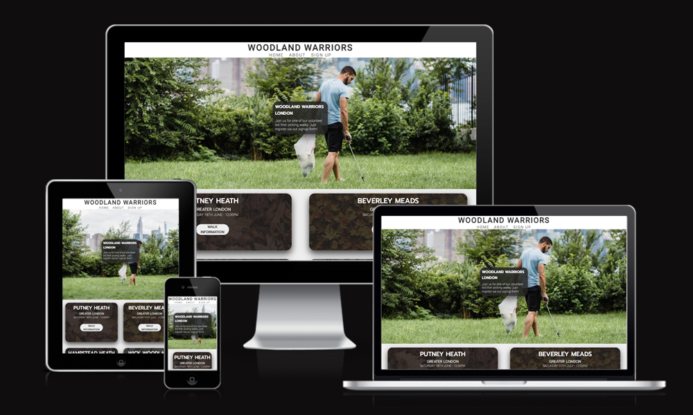

# **WOODLAND WARRIORS**
## HTML & CSS Portolio Project
 
Woodland Warriors is a three page, fully respsonsive, informational site for people looking to join organised voluntary litter picking walks, in woodland and park areas around London and Greater London. This site was created as a milestone project - the aim being to create a static front-end site to present useful information to users.
 
The goal of the site is to increase volunteer signups to support Woodland Warriors reach its organisational goals of cleaning up woodland and park areas in London and Greater London. The site does this by providing information about upcoming Woodland Warriors walks, general information about the orgnisation such as the mission and values, and a sign up form for users to register thier interest.
 

## [View Live Site](https://robtomatkins.github.io/Woodland-Warriors/index.html)

 

#  Table of Contents

- [UX](#a-namesection-1a-ux)
    - Overview
    - Color Story
        - Fonts
        - Images
        - Hover Attributes 
        - Anchor Links
- [Site Structure](#a-namesection-2a-site-structure)
    - Home Page Contents
    - About Page Contents
    - Signup Page Contents
    - Technologies
- [Site Features](#a-namesection-3a-site-features)
    - The Logo and Navigation Bar
    - The Hero Image
    - The 'Walks' Section
    - The 'About' Section
    - The Sign Up Form 
    - The Footer
- [Testing](#a-namesection-4a-testing)
    - Bugs
    - Responsive Testing
        - Web dev tools
    - Performance Testing
        - Lighthouse
    - Validation Testing
        - W3C HTML & CSS
    - Brower Testing
        - tested in firefox, safari and chrome
- [Deployment](#a-namesection-5a-deployment)
- [Credits](#a-namesection-6a-credits)
    - Content
    - Media 
- [Project Screenshots](#a-namesection-7a-project-screenshots)

#  UX

- ## Overview 
    - The site has been designed to be visually striking and simple to navigate, with all three pages linked via anchor links in thier sections, and the navigation bar which sits at the top of each page.
     
    Design elements run consistently throughout all three pages, such as the hero image (different image but same size), navigation bar, footer and colour scheme. The 'walks' and 'about' section both have the same layout but have different imagery for the text box backgrouds. 
 
 

- ## Colour Story 
    - #30302f
        - Dark Grey for fonts
 
 
    - #9cb466
        - Green to tie in with woodland theme
 
 
    - #eeeeee - off white as less harsh option to full white
 
 
    - rgba(33, 33, 33)
        - Converted to rgba from #30302f using [RGBA Color Picker](https://rgbacolorpicker.com/rgba-to-hex) so I could apply as transparent overlay and background
 
 
    - rgba(156, 180, 102) 
        - Converted to rgba from #9cb466 using [RGBA Color Picker](https://rgbacolorpicker.com/rgba-to-hex) so I could apply as transparent overlay and background

- ## Fonts
    - Downloaded from [Google Fonts](https://fonts.google.com/). Roboto (body) and Prompt (headings) were used at various weights throughout site. Roboto was used for the body and Prompt for the headings - these fonts were chosen as they visually compliment eachother well. 

- ## Images
    - Images were obtained from [Pexels](https://www.pexels.com/).

- ## Hover Attributes 
    - Hover attributes were a design choice to create interactivty, and to highlight links or information of importance, such as the links to [Woodland Trust](https://www.woodlandtrust.org.uk/) in the walks section. 

- ## Anchor Links
    - Anchor Links were used a design choice to asist with navigation on the site and also for the social media links and to provide further information in the 'walks' section. 
 

[Back to table of contents](#a-namesection-8a-table-of-contents)
 

#  Site Structure 

- ## Home Page Contents | [View live home page](https://robtomatkins.github.io/Woodland-Warriors/index.html)
    - Logo and navigation bar 
    - Hero image with centered text box to provide context
    - 'walks' section providing information about upcoming walks
    - Footer section with contact details and social media links
     
     
- ## About Page Contents | [View live about page](https://robtomatkins.github.io/Woodland-Warriors/about.html)
    - Logo and navigation bar
    - Custom hero image with centered text
    - 'about' section providing information about organisation
    - Footer section with contact details and social media links
     
     
- ## Signup Page Contents | [View live signup page](https://robtomatkins.github.io/Woodland-Warriors/sign-up.html)
    - Logo and navigation bar 
    - Cusom hero image 
    - Sign up form
    - Footer section with contact details and social media links 
     
     
- ## Technologies
    - HTML5
    - CSS
    - Git
    - Github 
    - [Font Awesome](https://fontawesome.com/sessions/sign-in) 
    - [Google Fonts](https://fonts.google.com/)
    - [Pexels](https://www.pexels.com/) 
    - [RGBA Color Picker](https://rgbacolorpicker.com/rgba-to-hex)

[Back to table of contents](#a-namesection-8a-table-of-contents)
 

#  Site Features

- ## [The Logo & Navigation Bar](#a-namesection-7a-project-screenshots) 

    - The logo featuring the organisation name is featured centrally at the top of the page with the navigation bar directly below.
    - The navigation bar inlcudes Home, About and Signup, all of which are links to corrisponding page.
    - The logo and navigation are the same color and letter spacing for consistency and the same on every page.
    - The navigation links display green when you hover over them to make it clear for user.
     
     
- ## [The Hero Image](#a-namesection-7a-project-screenshots)
    - The hero image for each page contains clear relevant visual clues as to what the website is about. 
    - The hero image changes on each page to make clear that you have changed page. 
    - Inside the landing page hero image is a text box containing information to make the purpose of the website clear.
    - Inside the About and Sign up page her image is a text box containing a qoute from members of Woodland Warrios to give information to viewers"
     
     
- ## [The Walks Section](#a-namesection-7a-project-screenshots)
    - The walks section provides information about upcoming walks, including thier location, date, time and difficulty level.
    - Each text box header changes colour when hovered over, this matches the about section for consistency running through the site.
    - Each walk location is a link to the signup page. 
     
     
- ## [The About Section](#a-namesection-7a-project-screenshots)
    - The about section provides information about the different aspects of Woodland Warriors, including the walks, the volunteers and the goal and mission of the organisation.
    - Each text box header changes colour when hovered over, this matches the walks section for consistency running through the site.
    - Each text box header is a link to the signup page. 
     
     
- ## [The Form section](#a-namesection-7a-project-screenshots)
    - The form section contains a sign up form and is located on the sign up page. The form collects the name and email address of the person wanting to sign up, and also gives the option to choose which walk you are interested in before submitting the form. 
     
     
- ## [The Footer Section](#a-namesection-7a-project-screenshots)
    - The footer section contains contact information for people interested in joining, including a telephone number and email address. 
    - The footer also contains icons that are links to corresponding social media platforms.
    - Each icon changes color when hovered over to match the theme of the rest of the website. 
     
     

[Back to table of contents](#a-namesection-8a-table-of-contents)
 

#  Testing

- I have tested the site to ensure it is fully repsonsive on mobile devices, ipads, laptops and desktops. I used devtools to do this. 

- I have confirmed the form input fields all require entry and the email address field will only accept and email address. 

- I have tested that the website works in Safari, Chrome and Firefox

- ### Bugs
    - No bugs found
     
     

- ### Unfixed Bugs
    - No unfixed bugs
     
     

- ### Validator Testing
    - HTML
        - No errors detected when code input into W3C validator.
    - CSS 
        - No errors detected when code input into W3C CSS validator.
    - Accessibility 
        - I have checked the site is accessible by running it through lighthouse in devtools.

- ### Functuality Testing
    - Form
        - I have attempted to submit the sign up form without content in each input field to check that the required attribute is funtioning. 
    - Social Media Links
        - I have checked that all links to external sites open in new tab, confirming that the _blank attribute is functioning. 

 
 

[Back to table of contents](#a-namesection-8a-table-of-contents)
 

#  Deployment

- The site was deployed to Github pages. The steps for depoyment were as follows:
    - I went to the settings tab in in Github Repository, and then to the pages section.
    - I then selected the main branch from the source drop down menu.
    - I was then provided with a link to published website.
    - Live site can be found here - [Woodland-Warriors](https://robtomatkins.github.io/Woodland-Warriors/)
 
 

[Back to table of contents](#a-namesection-8a-table-of-contents)
 

#  Credits

- ### Content
    - The code to make the social media links in the footer was taken from the CI Love Running Project
    - The template used on github is the CI full template

- ### Media
    - The images for the hero images and backgrounds for text boxes were taking from [Pexels](https://www.pexels.com/search/web%20developer/)
        - Lara Jameson - 'hero-image-home.jpg'
        - Lara Jameson - 'hero-image-about.jpg'
        - Cottonbro - 'hero-image-signup.jpg'
        - Peter Rock - 'walks-background-1.jpg']
        - Margerretta - 'walks-background-2.jpg]
        - Dimitry Llin - 'walks-background-3.jpg']
        - Inga Seliverstova - 'walks-background-4.jpg']
        - Karolina Grabowska - 'about-background-1.jpg']
        - Kelly L - about-background-2.jpg']
        - Stijin Dijkstra - 'about-background-3.jpg']
        - Leonid Danilov - 'about-background-4.jpg']

- ### Guides and Tutorials
    - [W3schools.com](https://www.w3schools.com/howto/default.asp) for design guides and tutorials
- ### README.md
    - [Marcin-Kli/MP1](https://github.com/marcin-kli/MP1/blob/Milestone-Projects/README.md#surface) READ.md from 'Annies Portfolio wesbite' used as guide
 
 

#### [Back to table of contents](#a-namesection-8a-table-of-contents)
 

#  Project Screenshots

[Back to table of contents](#a-namesection-8a-table-of-contents)

