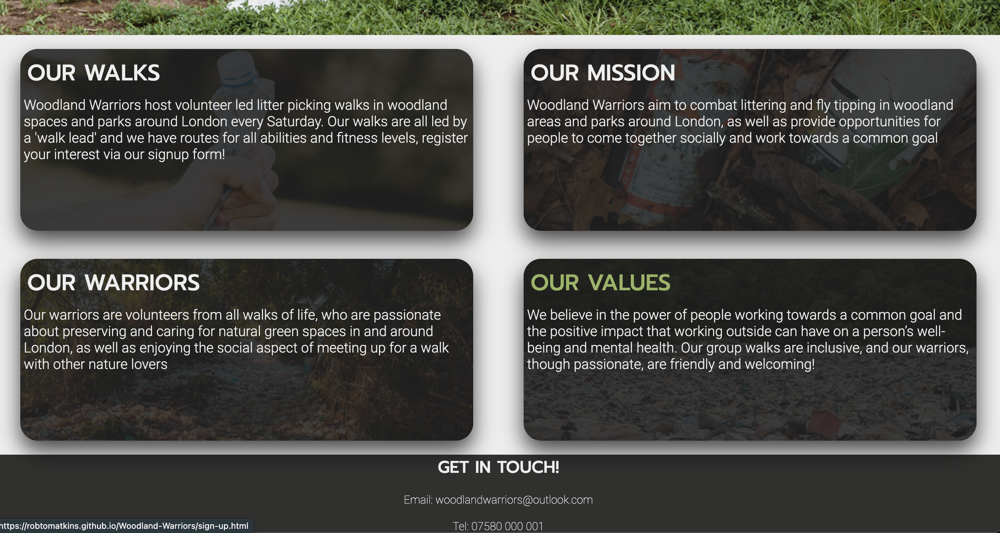

# Woodland Warriors
Woodland Warriors is a three page informational site targetting people looking to engage in voluntary litter picking in woodland and park areas, in and around London. The site consists of the [Home]() page, [About]() page and [Signup]() page. 

The Woodland Warriors 'Home' page displays information about upcoming walks including the location, time, date and difficulty level. The 'About' page displays information about the organisation, including about the walks, the volunteers themselves, and the organisational mission and values. The 'Signup' page includes a signup form which allows you to enter your contact details and choose the walk you're interested in. 
 
 

## Features

- ### The Logo & Navigation Bar

    - The logo featuring the organisation name is featured centrally at the top of the page with the navigation bar directly below.
    - The navigation bar inlcudes Home, About and Signup, all of which are links to corrisponding page.
    - The logo and navigation are the same color and letter spacing for consistency and the same on every page.
    - The navigation links display green when you hover over them to make it clear for user
 
 
    
 
 

- ### The Hero Image (Home, About and Signup)

    - The hero image for each page contains clear relevant visual clues as to what the website is about. 
    - The hero image changes on each page to make clear that you have changed page. 
    - Inside the landing page hero image is a text box containing information to make the purpose of the website clear.
    - Inside the About and Sign up page her image is a text box containing a qoute from members of Woodland Warrios to give information to viewers"

#### Home Page Hero Image

#### About Page Hero Image

#### Signup Page Hero Image

 
 

- ### The Walks Section (Upper and Lower)
    - The walks section provides information about upcoming walks, including thier location, date, time and difficulty level.
    - Each text box header changes colour when hovered over, this matches the about section for consistency running through the site.
    - Each walk location is a link to the signup page. 

 
 

- ### The About Section (Upper and Lower)
    - The about section provides information about the different aspects of Woodland Warriors, including the walks, the volunteers and the goal and mission of the organisation.
    - Each text box header changes colour when hovered over, this matches the walks section for consistency running through the site.
    - Each text box header is a link to the signup page. 

 
 

- ### The Form section
    - The form section contains a sign up form and is located on the sign up page. The form collects the name and email address of the person wanting to sign up, and also gives the option to choose which walk you are interested in before submitting the form. 

 
 

- ### The Footer Section
    - The footer section contains contact information for people interested in joining, including a telephone number and email address. 
    - The footer also contains icons that are links to corresponding social media platforms.
    - Each icon changes color when hovered over to match the theme of the rest of the website. 

 
 

## Testing

- I have tested the site to ensure it is fully repsonsive on mobile devices, ipads, laptops and desktops. I used devtools to do this. 

- I have confirmed the form input fields all require entry and the email address field will only accept and email address. 

- I have tested that the website works in Safari, Chrome and Firefox

- ### Bugs
    - No bugs found
 
 

- ### Unfixed Bugs
    - No unfixed bugs
 
 

- ### Validator Testing
    - HTML
        - No errors detected when code input into W3C validator.
    - CSS 
        - No errors detected when code input into W3C CSS validator.
    - Accessibility 
        - I have checked the site is accessible by running it through lighthouse in devtools.

 
 

## Deployment

- 

## Credits

- ### Content
    - The code to make the social media links in the footer was taken from the CI Love Running

- ### Media
    - The images for the hero images and backgrounds for text boxes were taking from [Pexels](https://www.pexels.com/search/web%20developer/)
 
 

